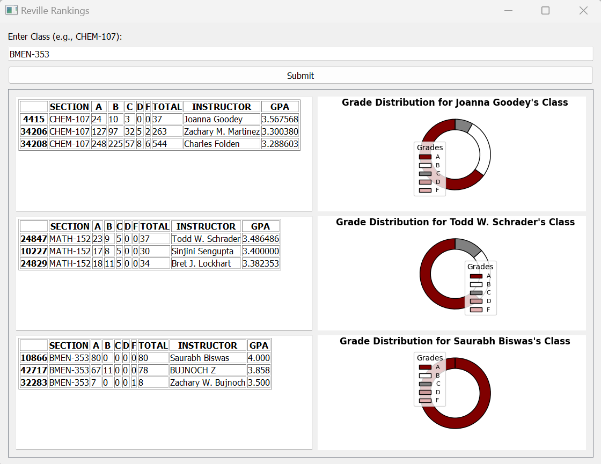

# RevilleRankings

## Description
RevilleRankings is a Python script that analyzes Texas A&M University's public grade distribution data from the past three years. The script identifies professors with the highest GPAs in their courses, providing a detailed breakdown of grades. It utilizes matplotlib to create visualizations of this data, making it easy to interpret the distribution of grades across different sections.

## Data Source
The grade distribution data used by this script can be found at the [Texas A&M University Grade Reports website](https://web-as.tamu.edu/gradereports/).

## Installation
To run this script, you will need Python and the following Python libraries:
- pandas
- matplotlib
- PyQt5

You can install these libraries using pip:

## Usage
To run the script, navigate to the directory containing the script and execute it with Python. Ensure you have the necessary data files in the same directory or specify the path to the files:

## Output
The script produces an interactive interface displaying the grade distribution for selected classes and instructors, as shown in the example image below. It also generates a CSV file containing the aggregated data.

